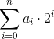

### 1492.Counting Ones

Carl is right now the happiest child in the world: he has just learned this morning what the binary system is. He learned, for instance, that the binary representation of a positive integer k is a string anan−1 · · · a1a0 where each ai is a binary digit 0 or 1, starting with an = 1, and such that 
. It is really nice to see him turning decimal numbers into binary numbers, and then adding and even multiplying them.

Caesar is Carl’s older brother, and he just can’t stand to see his little brother so happy. So he has prepared a challenge: “Look Carl, I have an easy question for you: I will give you two integers A and B, and you have to tell me how many 1’s there are in the binary representation of all the integers from A to B, inclusive. Get ready”. Carl agreed to the challenge.

After a few minutes, he came back with a list of the binary representation of all the integers from 1 to 100. “Caesar, I’m ready”. Caesar smiled and said: “Well, let me see, I choose A = 1015 and B = 1016. Your list will not be useful”

Carl hates loosing to his brother so he needs a better solution fast. Can you help him?

**Input**

The input consists of many test cases and ends with EOF. Each test case consist in a single line that contains two integers **A** and **B** (1 ≤ **A** ≤ **B** ≤ 1016).

**Output**

For each test case, print a line with an integer representing the total number of digits 1 in the binary representation of all the integers from **A** to **B**, inclusive.

| Input Sample | Output Sample |
| ------------ | ------------- |
| 1000000000000000 10000000000000000 | 239502115812196372 |
| 2 12 | 21 |
| 9007199254740992 9007199254740992 | 1 |
